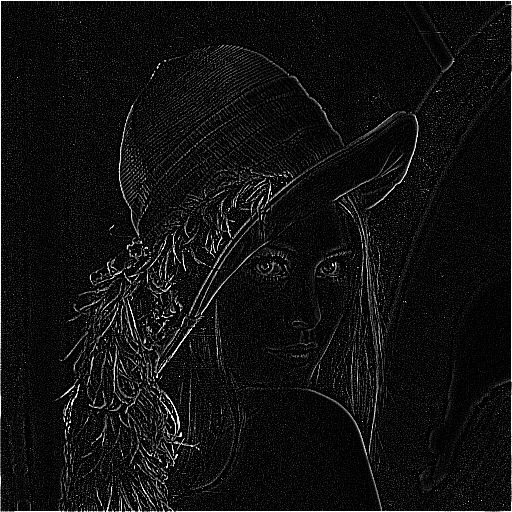

# Convolution Image Processing Method

## Overview

This repository introduces a versatile method for implementing convolution operations between images and filters. The method supports 2D filters of any dimension and seamlessly handles both grayscale and RGB images. In the case of RGB images, the filter is applied independently to each channel. The method ensures robust handling of pixels outside the image boundary by filling them with zeros during convolution. It is assumed that the kernels used are square.

## Examples of usage 
```python
from filtering.filtering import apply_filter
from filtering.helpers import *

image = read_image('tests/lenna.png')
display_image(image)
```


```python
for filter_name, kernel in filters.items():
    print(filter_name)
    display_image(apply_filter(image, kernel))
```
Identity

Gaussian blur 3x3 (approx)

Edge detection
